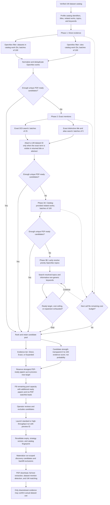

# Technical Architecture

DataSight is an API-first, queue-backed research data pipeline. The backend is a Python `src` layout package, the GUI is a Vite React app, and Docker Compose provides PostgreSQL, Redis, GROBID, the API, and the worker.

## System Shape

```text
GUI / CLI / API
  -> interfaces
  -> application services and orchestrator
  -> domain schemas and stage registry
  -> infrastructure adapters
  -> PostgreSQL, Redis, GROBID, OpenAlex, storage/
```

The FastAPI app starts at `datasight.interfaces.api.main:app`. The CLI starts at `datasight.interfaces.cli.main:main` and is exposed as `uv run datasight`.

## Runtime Components

| Component | Technology | Responsibility |
|---|---|---|
| API | FastAPI | HTTP contracts, OpenAPI docs, run monitoring, reset/import endpoints. |
| Worker | Celery | Long-running stage execution. |
| Queue | Redis | Celery broker and result backend. |
| Database | PostgreSQL + pgvector image | Durable publications, artifacts, mentions, matches, run state, and events. |
| PDF parser | GROBID | PDF to TEI XML conversion. |
| GUI | Vite, React, TypeScript | Operator dashboard for readiness, runs, events, insights, and reset. |
| Migrations | Alembic | Versioned database schema changes. |

## Backend Layout

```text
backend/
  pyproject.toml
  migrations/
  tests/
  src/datasight/
    domain/          shared schemas, stage names, result DTOs
    application/     stage services, full-run orchestration, reset logic
    infrastructure/  persistence, ingestion, worker, health, publication fetching
    interfaces/      FastAPI routes and CLI commands
    matching/        UM dataset matching and normalization
```

Layer rule: interfaces validate input and call application services; application code coordinates behavior; infrastructure owns side effects; domain code stays dependency-light.

## Stage Model

The canonical stage order lives in `datasight.domain.stages`:

```text
discover -> download_pdf -> grobid_convert -> render_document -> detect_mentions -> extract_features -> match_um_dataset -> export_insights
```

`datasight.application.stage_registry` is the shared source for stage descriptions, required arguments, keyword mapping, and Celery task lookup. This keeps API, CLI, and worker behavior aligned.

## Data Flow

1. `discover` materializes an operator-reviewed strategy-v2 preview for every production run. Catalog mode completes direct evidence first, then conditionally runs exact mentions, related works, and focused topic/keyword expansion until its PDF-ready target is met. Random mode uses OpenAlex's native seeded sample operation and preserves the draw order; manual mode runs one expert query. The direct query-first stage remains a development diagnostic only.
2. `download_pdf` downloads and validates open-access PDFs.
3. `grobid_convert` submits PDFs to GROBID and stores TEI XML.
4. `render_document` converts TEI XML into Markdown for extraction.
5. `detect_mentions` records high-recall dataset mention candidates.
6. `extract_features` promotes candidates into structured dataset mention records.
7. `match_um_dataset` compares mentions against imported UM dataset records and returns all candidate IDs when metadata-only evidence is ambiguous.
8. `export_insights` writes joined insight rows to CSV.

### Adaptive OpenAlex discovery funnel

This Mermaid block is compatible with Obsidian and Excalidraw's Mermaid importer:



## Persistence And Artifacts

PostgreSQL is the source of truth for durable state. `PipelineRepository` composes focused persistence modules for publications, discovery previews and candidates, artifacts, mentions, UM datasets, insights, runs, and events.

Generated files are written under:

```text
storage/pdf
storage/xml
storage/markdown
storage/exports
storage/logs
```

Curated source/reference files belong under `data/` and should not be removed by reset.

## API And Worker Flow

`POST /api/v1/runs` creates a pipeline run, stores run configuration, and enqueues Celery work. The GUI polls:

- `GET /api/v1/discovery/um-profile` and `/api/v1/openalex/status` before previewing
- `POST /api/v1/discovery/preview` to create an expiring strategy snapshot
- `GET /api/v1/runs/{run_id}` for run and stage summaries
- `GET /api/v1/runs/{run_id}/events` for chronological messages and errors
- `GET /api/v1/runs/{run_id}/discovery-candidates` for paginated discovery evidence
- `GET /api/v1/insights` for result preview

Celery task names use the `datasight.*` prefix. The worker command is:

```powershell
uv run celery -A datasight.infrastructure.worker.celery_app:celery_app worker --loglevel=INFO --pool=solo -Q celery,download,grobid,processing,matching,export
```

## Configuration

Local configuration comes from `.env` at the repository root. Important defaults:

```env
POSTGRES_DB=datasight_pipeline
OPENALEX_API_URL=https://api.openalex.org
OPENALEX_API_KEY=
OPENALEX_MAILTO=
REDIS_URL=redis://localhost:6379/0
GROBID_BASE_URL=http://localhost:8070
```

Compose uses service names for internal networking and exposes Postgres on `localhost:5433`, Redis on `localhost:6379`, GROBID on `localhost:8070`, and the API on `localhost:8000`.

## Reset Behavior

Reset lives in `datasight.application.reset` and requires:

```json
{
  "confirm": "RESET DATASIGHT",
  "force": true
}
```

It discovers and truncates pipeline-generated application tables in the current database schema, restarts their identity sequences, and deletes configured generated artifact paths under `storage/`. The imported `um_datasets` catalog and Alembic migration marker are preserved. Reset does not delete migrations, source files, `.env`, Docker volumes, or curated inputs in `data/`.

## Failure Modes

- Database readiness failures usually mean migrations have not run or the `.env` database port does not match the runtime.
- Worker readiness failures mean Redis may be up but no Celery worker responded.
- GROBID readiness failures block PDF conversion but not API startup.
- Missing UM dataset records can leave matching/export stages with no meaningful institutional matches.
- Bad PDF URLs, HTML responses served as PDFs, or malformed TEI XML are expected external-data failures and should surface as stage events.
